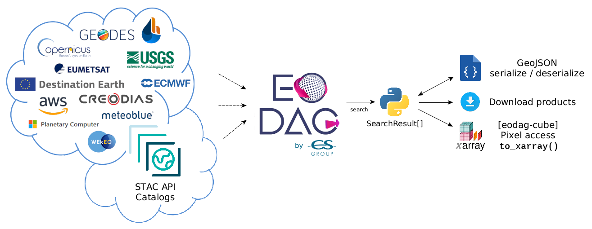

.. image:: https://eodag.readthedocs.io/en/latest/_static/eodag_bycs.png
    :target: https://github.com/CS-SI/eodag

|

.. image:: https://badge.fury.io/py/eodag.svg
    :target: https://badge.fury.io/py/eodag

.. image:: https://readthedocs.org/projects/pip/badge/?version=latest&style=flat
    :target: https://eodag.readthedocs.io/en/latest/

.. image:: https://img.shields.io/github/issues/CS-SI/eodag.svg
    :target: https://github.com/CS-SI/eodag/issues

.. image:: https://mybinder.org/badge_logo.svg
    :target: https://mybinder.org/v2/git/https%3A%2F%2Fgithub.com%2FCS-SI%2Feodag.git/master?filepath=examples%2Ftuto_basics.ipynb

|

.. image:: https://img.shields.io/pypi/l/eodag.svg
    :target: https://pypi.org/project/eodag/

.. image:: https://img.shields.io/pypi/pyversions/eodag.svg
    :target: https://pypi.org/project/eodag/

EODAG (Earth Observation Data Access Gateway) is a command line tool and a plugin-oriented Python framework for searching,
aggregating results and downloading remote sensed images while offering a unified API for data access regardless of the
data provider. The EODAG SDK is structured around three functions:

    * List product types: list of supported products and their description

    * Search products (by product type or uid) : searches products according to the search criteria provided

    * Download products : download product “as is"

EODAG is developed in Python. It is structured according to a modular plugin architecture, easily extensible and able to
integrate new data providers. Three types of plugins compose the tool:

    * Catalog search plugins, responsible for searching data (OpenSearch, CSW, ...), building paths, retrieving quicklook,
      combining results

    * Download plugins, allowing to download and retrieve data locally (via FTP, HTTP, ..), always with the same directory
      organization

    * Authentication plugins, which are used to authenticate the user on the external services used (JSON Token, Basic Auth, OAUTH, ...).

Since v2.0 EODAG can be run as `STAC client or server <https://eodag.readthedocs.io/en/latest/intro.html#stac-client-and-server>`_.

Read `the documentation <https://eodag.readthedocs.io/en/latest/>`_ for more insights.

Installation
============

EODAG is on `PyPI <https://pypi.org/project/eodag/>`_::

    python -m pip install eodag

Usage
=====

Command line interface
----------------------

Create a configuration file from the template `user_conf_template.yml` provided with the repository, filling
in your credentials as expected by each provider (note that this configuration file is required by now. However, this
will change in the future).

Then you can start playing with it:

* To search for products and crunch the results of the search::

        eodag search \
        --conf my_conf.yml \
        --box 1 43 2 44 \
        --start 2018-01-01 \
        --end 2018-01-31 \
        --cloudCover 20 \
        --productType S2_MSI_L1C
        --cruncher FilterLatestIntersect \
        --storage my_search.geojson

The request above search for product types `S2_MSI_L1C` and will crunch the result using cruncher `FilterLatestIntersect`
and storing the overall result to `my_search.geojson`.

You can pass arguments to a cruncher on the command line by doing this (example with using `FilterOverlap` cruncher
which takes `minimum_overlap` as argument)::

        eodag search -f my_conf.yml -b 1 43 2 44 -s 2018-01-01 -e 2018-01-31 -p S2_MSI_L1C \
                     --cruncher FilterOverlap \
                     --cruncher-args FilterOverlap minimum_overlap 10

The request above means : "Give me all the products of type `S2_MSI_L1C`, use `FilterOverlap` to keep only those products
that are contained in the bbox I gave you, or whom spatial extent overlaps at least 10% (`minimum_overlap`) of the surface
of this bbox"

* To download the result of a previous call to `search`::

        eodag download --conf my_conf.yml --search-results my_search.geojson

* To list all available product types and supported providers::

        eodag list

* To list available product types on a specified supported provider::

        eodag list -p sobloo

* To see all the available options and commands::

        eodag --help

* To print log messages, add `-v` to `eodag` master command. e.g. `eodag -v list`. The more `v` given (up to 3), the more
  verbose the tool is. For a full verbose output, do for example: ``eodag -vvv list``

STAC REST API
-------------

An eodag installation can be exposed through a STAC compliant REST api from the command line::

    # eodag serve-rest --help
    Usage: eodag serve-rest [OPTIONS]

      Start eodag HTTP server

    Options:
      -f, --config PATH   File path to the user configuration file with its
                          credentials
      -d, --daemon TEXT   run in daemon mode
      -w, --world         run flask using IPv4 0.0.0.0 (all network interfaces),
                          otherwise bind to 127.0.0.1 (localhost). This maybe
                          necessary in systems that only run Flask  [default:
                          False]
      -p, --port INTEGER  The port on which to listen  [default: 5000]
      --debug             Run in debug mode (for development purpose)  [default:
                          False]
      --help              Show this message and exit.

Python API
----------

Example usage for interacting with the api in your Python code:

.. code-block:: python

    from eodag import EODataAccessGateway

    dag = EODataAccessGateway()
    product_type = 'S2_MSI_L1C'
    footprint = {'lonmin': 1, 'latmin': 43.5, 'lonmax': 2, 'latmax': 44}
    start, end = '2021-01-01', '2021-01-15'
    search_results = dag.search(productType=product_type, geom=footprint, start=start, end=end)
    product_paths = dag.download_all(search_results)
    for path in product_paths:
        print('Downloaded : {}'.format(path))

Contribute
==========

If you intend to contribute to eodag source code::

    git clone https://github.com/CS-SI/eodag.git
    cd eodag
    python -m pip install -r requirements-dev.txt
    pre-commit install

To run the default test suite (which excludes end-to-end tests)::

    tox

To only run end-to-end test::

    tox -- tests.test_end_to_end

To run the entire tests (units, integration and end-to-end)::

    tox -- tests eodag

.. note::

    * Running the `tox` command will also build the docs. As The documentation
      includes some notebooks (for the turorials), the build process will need
      `pandoc <http://pandoc.org>`_ to succeed. If the build process fails for
      you, please `install <http://pandoc.org/installing.html>`_ pandoc and try
      again.

    * When contributing to tutorials, you will need to keep notebook outputs
      and save widget state. Otherwise outputs will not be visible in documentation.

    * eodag is tested against python versions 3.6, 3.7, 3.8 and 3.9. Ensure you have
      these versions installed before you run tox. You can use
      `pyenv <https://github.com/pyenv/pyenv>`_ to manage many different versions
      of python

Releases are made by tagging a commit on the master branch. To make a new release,

    * Ensure you correctly updated `README.rst` and `CHANGES.rst` (and occasionally,
      also `NOTICE` - in case a new dependency is added).
    * Check that the version string in `eodag/__meta__.py` (the variable `__version__`)
      is correctly updated
    * Push your local master branch to remote.
    * Tag the commit that represents the state of the release with a message. For example,
      for version 1.0, do this: `git tag -a v1.0 -m 'version 1.0'`
    * Push the tags to github: `git push --tags`.

The documentation is managed by a webhook, and the latest documentation on readthedocs follows
the documentation present in `master`. Therefore, there is nothing to do apart from updating
the `master` branch to publish the latest documentation.

LICENSE
=======

EODAG is licensed under Apache License v2.0.
See LICENSE file for details.

AUTHORS
=======

EODAG is developed by `CS GROUP - France <https://www.c-s.fr>`_.

CREDITS
=======

EODAG is built on top of amazingly useful open source projects. See NOTICE file for details about those projects and
their licenses.
Thank you to all the authors of these projects !
