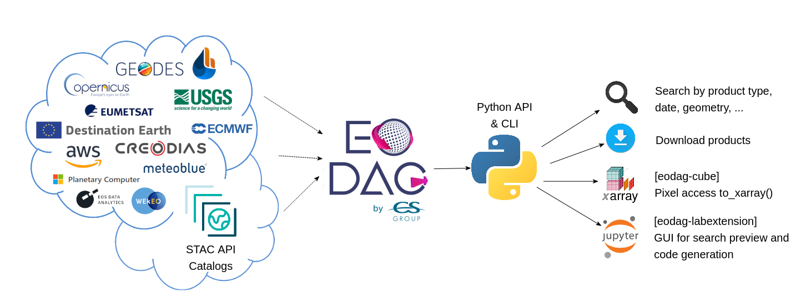

.. eodag documentation master file, created by
   sphinx-quickstart on Thu Feb  1 09:22:31 2018.
   You can adapt this file completely to your liking, but it should at least
   contain the root `toctree` directive.

.. role:: raw-html(raw)
    :format: html

Earth Observation Data Access Gateway (|version|)
=================================================

:raw-html:``
:raw-html:``
:raw-html:``
:raw-html:``
:raw-html:``

**EODAG (Earth Observation Data Access Gateway) is a command line tool and a Python package for searching and downloading
remotely sensed images while offering a unified API for data access regardless of the data provider.**

|

EODAG gives you an easy way to access products from more than 10 providers, with more than 50 different product
types (Sentinel 1, Sentinel 2, Sentinel 3, Landsat, etc.) that can be searched and downloaded.

.. glossary::

    [Growing list of] supported providers
      `aws_eos <https://eos.com>`_,
      `cop_ads <https://ads.atmosphere.copernicus.eu>`_,
      `cop_cds <https://cds.climate.copernicus.eu>`_,
      `cop_dataspace <https://dataspace.copernicus.eu/>`_,
      `cop_ewds <https://ewds.climate.copernicus.eu>`_,
      `cop_marine <https://marine.copernicus.eu>`_,
      `creodias <https://creodias.eu>`_,
      `creodias_s3 <https://creodias.eu>`_,
      `dedl <https://hda.data.destination-earth.eu/ui>`_,
      `dedt_lumi <https://polytope.lumi.apps.dte.destination-earth.eu/openapi>`_,
      `earth_search <https://www.element84.com/earth-search/>`_,
      `earth_search_gcs <https://cloud.google.com/storage/docs/public-datasets>`_,
      `ecmwf <https://www.ecmwf.int>`_,
      `geodes <https://geodes.cnes.fr>`_,
      `geodes_s3 <https://geodes.cnes.fr>`_,
      `eumetsat_ds <https://data.eumetsat.int>`_,
      `hydroweb_next <https://hydroweb.next.theia-land.fr>`_,
      `meteoblue <https://content.meteoblue.com/en/business-solutions/weather-apis/dataset-api>`_,
      `peps <https://peps.cnes.fr/rocket/#/home>`_,
      `planetary_computer <https://planetarycomputer.microsoft.com>`_,
      `sara <https://copernicus.nci.org.au>`_,
      `theia <https://theia.cnes.fr/atdistrib/rocket>`_,
      `usgs <https://earthexplorer.usgs.gov>`_,
      `usgs_satapi_aws <https://landsatlook.usgs.gov>`_,
      `wekeo_cmems <https://www.wekeo.eu>`_,
      `wekeo_ecmwf <https://www.wekeo.eu>`_,
      `wekeo_main <https://www.wekeo.eu>`_

EODAG has the following primary features:

* Search and download Earth Observation products from different providers with **a unified API**
* It is both a `Command Line Tool <cli_user_guide.rst>`_ and a `Python Package <api_user_guide.rst>`_
* It supports `STAC and Static STAC <notebooks/tutos/tuto_stac_client.ipynb>`_ catalogs
* It can run as a `STAC API REST server <stac_rest.rst>`_ to give access to a provider's catalog
* New providers can be added with a `configuration file <add_provider.rst>`_ or by extending EODAG with `plugins <plugins.rst>`_

Example
-------

`Register <getting_started_guide/register.rst>`_ to one or more providers,
`configure your credentials <getting_started_guide/configure.rst>`_ , and then
downloading *Sentinel 2 Level-1C* products from any provider's catalog is as simple as:

.. code-block:: python

   from eodag import EODataAccessGateway

   dag = EODataAccessGateway()

   search_results = dag.search(
       productType="S2_MSI_L1C",
       start="2021-03-01",
       end="2021-03-31",
       geom={"lonmin": 1, "latmin": 43, "lonmax": 2, "latmax": 44}
   )

   product_paths = dag.download_all(search_results)

.. admonition:: `Breaking change <breaking_changes.html>`_ in v3.0.0
   :class: important

   :meth:`~eodag.api.core.EODataAccessGateway.search` method now returns only a single
   :class:`~eodag.api.search_result.SearchResult` instead of a 2 values tuple.

Or:

.. code-block:: bash

   eodag search --productType S2_MSI_L1C --box 1 43 2 44 --start 2021-03-01 --end 2021-03-31
   eodag download  --search-results search_results.geojson

License
-------

EODAG is available under the open source `Apache License`__.

__ https://www.apache.org/licenses/LICENSE-2.0.html

Site contents
-------------

.. toctree::
   :maxdepth: 2
   :caption: For Users

   getting_started_guide/index
   api_user_guide
   api_reference/index
   breaking_changes
   cli_user_guide
   stac
   tutos

.. toctree::
   :maxdepth: 2
   :caption: For Developers/Contributors

   add_provider
   add_product_type
   plugins
   drivers
   params_mapping
   contribute
   changelog
   GitHub Repository <https://github.com/CS-SI/eodag>
