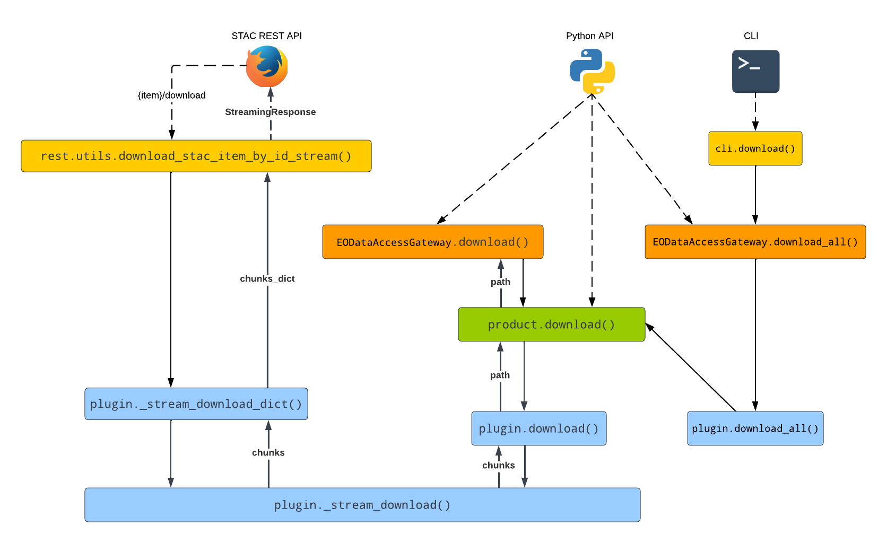

.. module:: eodag.plugins.download

================
Download Plugins
================

Download plugins must inherit the following class and implement :meth:`download`:

.. autoclass:: eodag.plugins.download.base.Download
   :members:

Here is a graph showing how download methods are called from API to plugin:

This table lists all the download plugins currently available:

.. autosummary::
   :toctree: generated/

   eodag.plugins.download.http.HTTPDownload
   eodag.plugins.download.aws.AwsDownload
   eodag.plugins.download.s3rest.S3RestDownload

-------------
Progress bars
-------------

While downloading, progress bars are generated using :py:class:`~eodag.utils.ProgressCallback`. They are instantiated
and closed in :meth:`EOProduct.download() <eodag.api.product._product.EOProduct.download>` which means that plugins do
not need to handle this part. Using :meth:`~eodag.api.core.EODataAccessGateway.download_all`, one progress bar will be
created and closed for each product.

The same progress bar will always be used to track both individual product download and extraction.

If a custom :py:class:`~eodag.utils.ProgressCallback` is passed as argument of
:meth:`~eodag.api.core.EODataAccessGateway.download` or :meth:`~eodag.api.core.EODataAccessGateway.download_all`, it
will be used and duplicated to create bars to track `download_all`/`download`. The same bar will be used for all
products, and will not be closed by `eodag`.

.. list-table:: ProgressCallback handling
   :widths: 25 25 25 25
   :header-rows: 1
   :stub-columns: 1

   * -
     - :meth:`plugin.download_all() <eodag.plugins.download.base.Download.download_all>`
     - :meth:`product.download() <eodag.api.product._product.EOProduct.download>`
     - Output
   * - :meth:`download(product)<eodag.api.core.EODataAccessGateway.download>`
     -
     - Default :class:`~eodag.utils.ProgressCallback` created for product `download`/`extraction`, then closed
     -  .. figure:: ../_static/progress_1_none.png
   * - :meth:`download(product, progress_callback=bar)<eodag.api.core.EODataAccessGateway.download>`
     -
     - Passed :class:`~eodag.utils.ProgressCallback` used for product `download`/`extraction`, kept open
     -  .. figure:: ../_static/progress_1.png
   * - :meth:`download_all(products)<eodag.api.core.EODataAccessGateway.download_all>`
     - Default :class:`~eodag.utils.ProgressCallback` created for products count, then closed
     - Default :class:`~eodag.utils.ProgressCallback` created per product for `download`/`extraction`, then closed
     -  .. figure:: ../_static/progress_2_none.png
   * - :meth:`download_all(products, progress_callback=bar)<eodag.api.core.EODataAccessGateway.download_all>`
     - Passed :class:`~eodag.utils.ProgressCallback` used for products count, copied for
       :meth:`product.download() <eodag.api.product._product.EOProduct.download>`, then closed.
     - Passed :class:`~eodag.utils.ProgressCallback` used for all products `download`/`extraction`, kept open
     -  .. figure:: ../_static/progress_2.png
