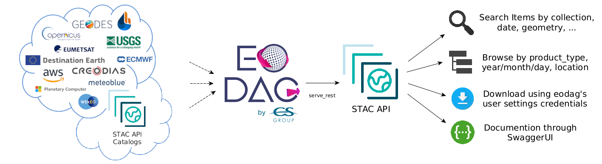
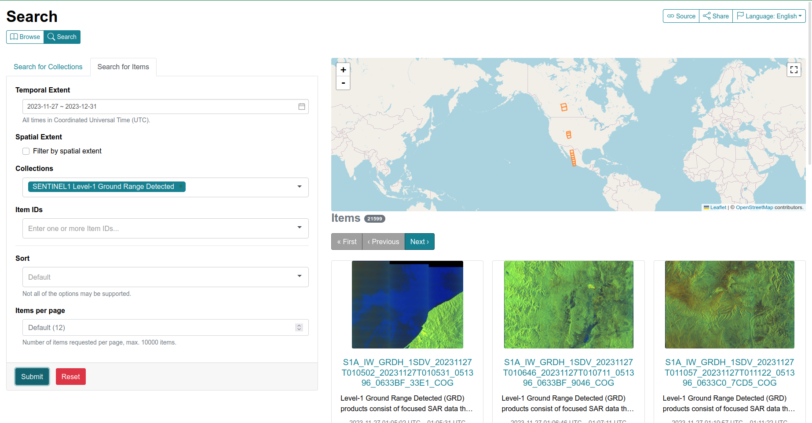

.. _stac_rest:

STAC REST Interface
===================

EODAG has a STAC compliant REST API. It can serve configured providers data through
this STAC API. To run the server, do:

.. code-block:: console

    eodag serve-rest

Below is the content of the help message of this command (`eodag serve-rest --help`):

.. code-block:: console

    Usage: eodag serve-rest [OPTIONS]

      Start eodag HTTP server

    Options:
      -f, --config PATH   File path to the user configuration file with its
                          credentials, default is ~/.config/eodag/eodag.yml
      -d, --daemon        run in daemon mode  [default: False]
      -w, --world         run flask using IPv4 0.0.0.0 (all network interfaces),
                          otherwise bind to 127.0.0.1 (localhost). This maybe
                          necessary in systems that only run Flask  [default:
                          False]
      -p, --port INTEGER  The port on which to listen  [default: 5000]
      --debug             Run in debug mode (for development purpose)  [default:
                          False]
      --help              Show this message and exit.

Searching
---------

After you have launched the server, navigate to its home page. For example, for a local
development server launched with ``eodag serve-rest -f <config> --debug``, go to
http://127.0.0.1:5000/service-doc. You will see a documentation of the interface.

Available operations are:

* List product types as collections::

    # All supported product types
    http://127.0.0.1:5000/collections

    # <provider> only supported product types
    http://127.0.0.1:5000/collections/?provider=<provider>

* Search product::

    http://127.0.0.1:5000/search/?param=value

The supported request parameters are (from STAC API):

* ``collections``: the product type
* ``bbox``: the search bounding box defined by: `min_lon,min_lat,max_lon,max_lat`.
* ``datetime``: RFC 3339 format datetime. Single, or as interval `start/stop`.
* ``limit``: items returned per page

EODAG additional query parameters:

* ``provider``: preferred provider
* ``customParameter``: any custom querry parameter supported by the provider

Example URL:

* http://127.0.0.1:5000/search?collections=S2_MSI_L1C&bbox=0,43,1,44&datetime=2018-01-20/2018-01-25&cloudCover=20

Browsing
---------

EODAG provides additional catalogs that extend browsing/filtering capabilities:

* ``country`` -> filters items on a specific area defined by selected country
* ``year``
        * ``month``
                * ``day`` -> filters items using specified time interval
* ``cloud_cover`` -> filters items with specified maximum cloud cover

Example URLs:

* http://127.0.0.1:5000/S2_MSI_L1C/country : lists available countries
* http://127.0.0.1:5000/S2_MSI_L1C/country/FRA/year/2019/month/10/cloud_cover/10 : catalog referencing S2_MSI_L1C
  products over France, aquired during October 2019, and having 10% maximum cloud cover

Browsing over catalogs can be experienced connecting EODAG STAC API to
`STAC-Browser <https://github.com/radiantearth/stac-browser>`_. Simply run:

.. code-block:: bash

    git clone https://github.com/CS-SI/eodag.git
    cd eodag
    docker-compose up

And browse http://127.0.0.1:5001:

