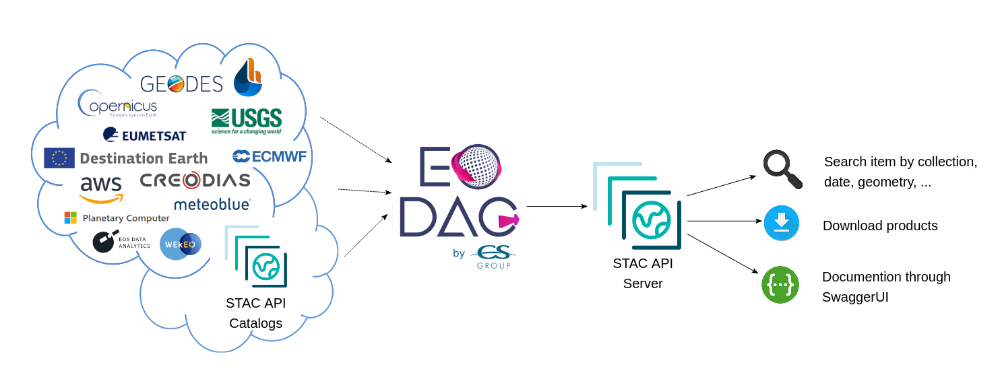

.. _stac_rest:

STAC REST API
=============

EODAG has a STAC compliant REST API. It can serve configured providers data through
this STAC API. To run the server, do:

.. code-block:: console

    eodag serve-rest

Below is the content of the help message of this command (`eodag serve-rest --help`):

.. code-block:: console

    Usage: eodag serve-rest [OPTIONS]

      Start eodag HTTP server

      Set EODAG_CORS_ALLOWED_ORIGINS environment variable to configure Cross-
      Origin Resource Sharing allowed origins as comma-separated URLs (e.g.
      'http://somewhere,htttp://somewhere.else').

    Options:
      -f, --config PATH   File path to the user configuration file with its
                          credentials, default is ~/.config/eodag/eodag.yml
      -l, --locs PATH     File path to the location shapefiles configuration file
      -d, --daemon        run in daemon mode
      -w, --world         run uvicorn using IPv4 0.0.0.0 (all network interfaces),
                          otherwise bind to 127.0.0.1 (localhost).
      -p, --port INTEGER  The port on which to listen  [default: 5000]
      --debug             Run in debug mode (for development purpose)
      --help              Show this message and exit.

Searching
---------

After you have launched the server, navigate to its home page. For example, for a local
development server launched with ``eodag serve-rest -f <config> --debug``, go to
http://127.0.0.1:5000/service-doc. You will see a documentation of the interface.

Available operations are:

* List product types as collections::

    # All supported product types
    http://127.0.0.1:5000/collections

    # <provider> only supported product types
    http://127.0.0.1:5000/collections/?provider=<provider>

* Search product::

    http://127.0.0.1:5000/search/?param=value

The supported request parameters are (from STAC API):

* ``collections``: the product type
* ``bbox``: the search bounding box defined by: `min_lon,min_lat,max_lon,max_lat`.
* ``datetime``: RFC 3339 format datetime. Single, or as interval `start/stop`.
* ``limit``: items returned per page

EODAG additional query parameters:

* ``provider``: preferred provider
* ``customParameter``: any custom querry parameter supported by the provider

Example URL:

* http://127.0.0.1:5000/search?collections=S2_MSI_L1C&bbox=0,43,1,44&datetime=2018-01-20/2018-01-25&cloudCover=20

STAC Browser
-------------

The STAC Browser can be used to browse data in a graphic user interface.

Start the eodag server with

``EODAG_CORS_ALLOWED_ORIGINS=https://radiantearth.github.io eodag -vvv serve-rest``

and then open https://radiantearth.github.io/stac-browser/#/external/http:/127.0.0.1:5000.

.. image:: _static/stac_browser_example.png
   :width: 800
   :alt: STAC browser example

The STAC Browser can also be used with docker-compose:

.. code-block:: bash

    git clone https://github.com/CS-SI/eodag.git
    cd eodag
    docker-compose up
    # or for a more verbose logging:
    EODAG_LOGGING=3 docker-compose up

(The definition of the ``EODAG_LOGGING`` environment variable will increase ``eodag``
logging level and accepts the values 1, 2, or 3 (3=maximum level).)

Browse http://127.0.0.1:5001

docker
------

In addition of the *docker-compose* configuration included in sources and described just above, ``eodag-server`` is
available on `https://hub.docker.com/r/csspace/eodag-server <https://hub.docker.com/r/csspace/eodag-server>`_:

.. code-block:: bash

    $ docker run -p 5000:5000 --rm csspace/eodag-server:3.4.2

Example
-------

.. code-block:: bash

    # list available product types for ``peps`` provider:
    $ curl "http://127.0.0.1:5000/collections?provider=peps" | jq ".collections[].id"
    "S1_SAR_GRD"
    "S1_SAR_OCN"
    "S1_SAR_SLC"
    "S2_MSI_L1C"
    "S2_MSI_L2A"
    "S3_EFR"
    "S3_ERR"
    "S3_LAN"
    "S3_OLCI_L2LFR"
    "S3_OLCI_L2LRR"
    "S3_SLSTR_L1RBT"
    "S3_SLSTR_L2LST"

    # search for items
    $ curl "http://127.0.0.1:5000/search?collections=S2_MSI_L1C&bbox=0,43,1,44&datetime=2018-01-20/2018-01-25" \
    | jq ".numberMatched"
    6

    # browse for items
    $ curl "http://127.0.0.1:5000/collections/S2_MSI_L1C/items" \
    | jq ".numberMatched"
    9

    # get download link
    $ curl "http://127.0.0.1:5000/collections/S2_MSI_L1C/items" \
    | jq ".features[0].assets.downloadLink.href"
    "http://127.0.0.1:5002/collections/S2_MSI_L1C/items/S2B_MSIL1C_20240917T115259_N0511_R137_T21CWS_20240917T145134/download"

    # download
    $ wget "http://127.0.0.1:5002/collections/S2_MSI_L1C/items/S2B_MSIL1C_20240917T115259_N0511_R137_T21CWS_20240917T145134/download"
