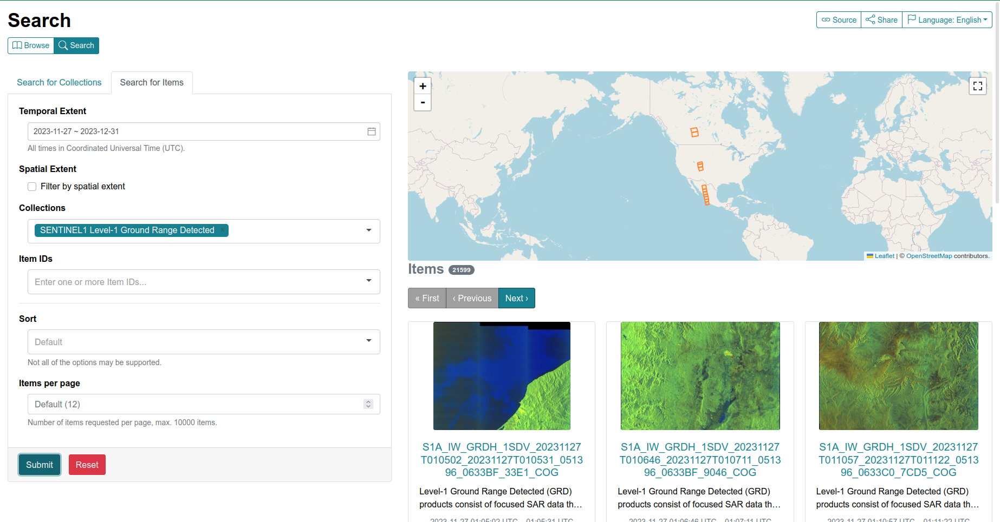

.. _use:

STAC REST Interface
===================

.. image:: _static/eodag_stac_server.png
   :width: 800
   :alt: EODAG as STAC server
   :class: no-scaled-link

EODAG has a STAC compliant REST API. It can serve configured providers data through
this STAC API. To run the server, do:

.. code-block:: console

    eodag serve-rest

Below is the content of the help message of this command (`eodag serve-rest --help`):

.. code-block:: console

    Usage: eodag serve-rest [OPTIONS]

      Start eodag HTTP server

    Options:
      -f, --config PATH   File path to the user configuration file with its
                          credentials, default is ~/.config/eodag/eodag.yml
      -d, --daemon        run in daemon mode  [default: False]
      -w, --world         run flask using IPv4 0.0.0.0 (all network interfaces),
                          otherwise bind to 127.0.0.1 (localhost). This maybe
                          necessary in systems that only run Flask  [default:
                          False]
      -p, --port INTEGER  The port on which to listen  [default: 5000]
      --debug             Run in debug mode (for development purpose)  [default:
                          False]
      --help              Show this message and exit.

Searching
---------

After you have launched the server, navigate to its home page. For example, for a local
development server launched with `eodag serve-rest -f <config> --debug`, go to
http://127.0.0.1:5000/service-doc. You will see a documentation of the interface.

Available operations are:

* List product types as collections::

    # All supported product types
    http://127.0.0.1:5000/collections

    # <provider> only supported product types
    http://127.0.0.1:5000/collections/?provider=<provider>

* Search product::

    http://127.0.0.1:5000/search/?param=value

The supported request parameters are (from STAC API):

* `collections`: the product type
* `bbox`: the search bounding box defined by: min_lon,min_lat,max_lon,max_lat.
* `datetime`: RFC 3339 format datetime. Single, or as interval `start/stop`.
* `limit`: items returned per page

EODAG additional query parameters:

* `provider`: preferred provider
* `customParameter`: any custom querry parameter supported by the provider

Example URL:

* http://127.0.0.1:5000/search?collections=S2_MSI_L1C&bbox=0,43,1,44&datetime=2018-01-20/2018-01-25&cloudCover=20

Browsing
---------

EODAG provides additional catalogs that extend browsing/filtering capabilities:

* `country` -> filters items on a specific area defined by selected country
* `year`
        * `month`
                * `day` -> filters items using specified time interval
* `cloud_cover` -> filters items with specified maximum cloud cover

Example URLs:

* http://127.0.0.1:5000/S2_MSI_L1C/country : lists available countries
* http://127.0.0.1:5000/S2_MSI_L1C/country/FRA/year/2019/month/10/cloud_cover/10 : catalog referencing S2_MSI_L1C
  products over France, aquired during October 2019, and having 10% maximum cloud cover

Browsing over catalogs can be experienced connecting EODAG STAC API to
`STAC-Browser <https://github.com/radiantearth/stac-browser>`_. Simply run:

.. code-block:: bash

    git clone https://github.com/CS-SI/eodag.git
    cd eodag
    docker-compose up

And browse http://127.0.0.1:5001:

Command line interface
======================

Make sure you correctly followed instructions on :ref:`user-config-file`.

Then you can start playing with it:

* Run `eodag --help` to display all the available options and commands:

.. code-block:: console

        Usage: eodag [OPTIONS] COMMAND [ARGS]...

        Earth Observation Data Access Gateway: work on EO products from any
        provider

        Options:
        -v, --verbose  Control the verbosity of the logs. For maximum verbosity,
                        type -vvv
        --help         Show this message and exit.

        Commands:
        deploy-wsgi-app  Configure the settings of the HTTP web app (the
                        providers...
        download         Download a list of products from a serialized search...
        list             List supported product types
        search           Search satellite images by their product types,...
        serve-rest       Start eodag HTTP server
        serve-rpc        Start eodag rpc server
        version          Print eodag version and exit

* Each command has its own help, see for instance the help of the `list` command with `eodag list --help`:

.. code-block:: console

        Usage: eodag list [OPTIONS]

        List supported product types

        Options:
        -p, --provider TEXT             List product types supported by this
                                        provider
        -i, --instrument TEXT           List product types originating from this
                                        instrument
        -P, --platform TEXT             List product types originating from this
                                        platform
        -t, --platformSerialIdentifier TEXT
                                        List product types originating from the
                                        satellite identified by this keyword
        -L, --processingLevel TEXT      List product types of processing level
        -S, --sensorType TEXT           List product types originating from this
                                        type of sensor
        --help                          Show this message and exit.

* By default the command line interface of `eodag` is set to the minimum verbosity level. You can print more
  log messages by adding `-v` to `eodag` master command. The more `v` given (up to 3), the more verbose the tool is.
  This feature comes in handy when you want to inspect an error or an unexpected behaviour. 4 different verbosity levels
  are offered to you:

.. code-block:: console

        eodag list
        eodag -v list
        eodag -vv list
        eodag -vvv list

* To search for products and crunch the results of the search:

.. code-block:: console

        eodag search \
        --conf my_conf.yml \
        --box 1 43 2 44 \
        --start 2018-01-01 --end 2018-01-31 \
        --productType S2_MSI_L1C \
        --all \
        --storage my_search.geojson

The request above searches for `S2_MSI_L1C` product types in a given bounding box, in January 2018. The command fetches internally all
the products that match these criteria. Without `--all`, it would only fetch the products found on the first result page.
It finally saves the results in a GeoJSON file.

You can pass arguments to a cruncher on the command line by doing this (example with using `FilterOverlap` cruncher
which takes `minimum_overlap` as argument):

.. code-block:: console

        eodag search -f my_conf.yml -b 1 43 2 44 -s 2018-01-01 -e 2018-01-31 -p S2_MSI_L1C --all \
                     --cruncher FilterOverlap \
                     --cruncher-args FilterOverlap minimum_overlap 10

The request above means : "Give me all the products of type `S2_MSI_L1C`, use `FilterOverlap` to keep only those products
that are contained in the bbox I gave you, or whose spatial extent overlaps at least 10% (`minimum_overlap`) of the surface
of this bbox"

You can use `eaodag search` with custom parameters. Custom parameters will be used as is in the query string search sent
to the provider. For instance, if you want to add foo=1 and bar=2 to the previous query:

.. code-block:: console

        eodag search -f my_conf.yml -b 1 43 2 44 -s 2018-01-01 -e 2018-01-31 -p S2_MSI_L1C \
                     --cruncher FilterOverlap \
                     --cruncher-args FilterOverlap minimum_overlap 1 \
                     --custom "foo=1&bar=2"

* To download the result of a previous call to `search`:

.. code-block:: console

        eodag download --conf my_conf.yml --search-results my_search.geojson

* To list all available product types and supported providers:

.. code-block:: console

        eodag list

* To list available product types on a specified supported provider:

.. code-block:: console

        eodag list -p sobloo
